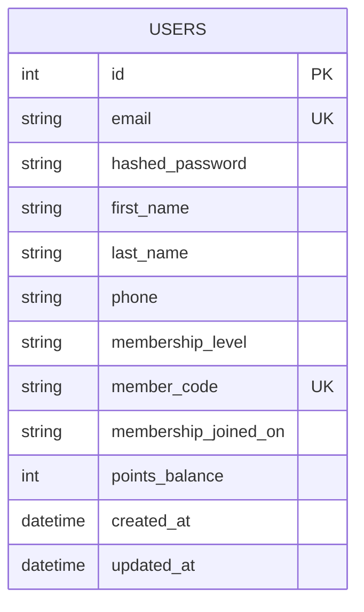
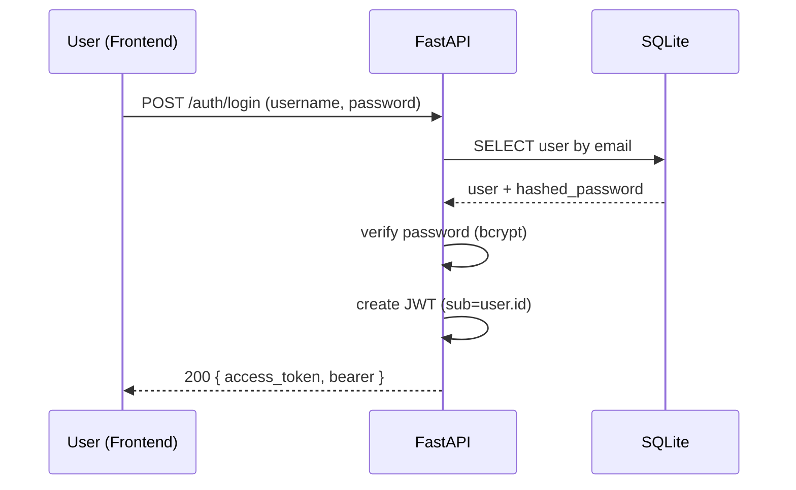

## Kline R Monorepo

This repo contains a React frontend and a FastAPI backend with SQLite, JWT auth, and profile management.

### Structure
- `my-react-app/` – Vite + React app
- `backend/` – FastAPI app (SQLite, SQLAlchemy, JWT)
- `docs/` – Architecture docs

### Backend (FastAPI)
Requirements installed following the FastAPI tutorial: [Tutorial - Install FastAPI](https://fastapi.tiangolo.com/tutorial/#install-fastapi).

Run (first time):
```bash
cd backend
python3 -m venv .venv
source .venv/bin/activate
pip install "fastapi[standard]" "SQLAlchemy" "passlib[bcrypt]" "python-jose[cryptography]" "alembic"
fastapi dev main.py
```

Base URL: `http://127.0.0.1:8000`  |  Docs: `http://127.0.0.1:8000/docs`

#### Endpoints
- `POST /auth/register` – create user
- `POST /auth/login` – OAuth2 password login → `{ access_token, token_type }`
- `GET /me` – current user profile (Bearer token)
- `PUT /me` – update profile fields (Bearer token)

Payload samples
```json
// Register
{
  "email": "somchai@example.com",
  "password": "secret123",
  "first_name": "สมชาย",
  "last_name": "ใจดี",
  "phone": "081-234-5678"
}
```
```json
// Update profile
{
  "first_name": "สมชาย",
  "last_name": "ใจดี",
  "phone": "081-234-5678",
  "membership_level": "Gold",
  "points_balance": 15420
}
```

### Frontend (React)
Run:
```bash
cd my-react-app
npm i
npm run dev
```
The backend enables CORS for `http://localhost:5173` by default.

### Database Docs
- ER diagram: `docs/database.md`


### Sequence Diagrams
- Flows: `docs/sequence.md`


### Notes
- SQLite file lives at `backend/app.db`.
- Change `SECRET_KEY` in `backend/auth.py` for production.


