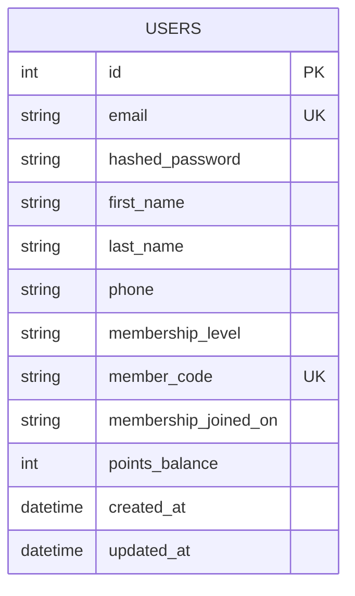

### Database Design (ER Diagram)

Notes:
- `email` is unique and used for login.
- `member_code` mirrors the membership card code shown in the UI.
- `membership_joined_on` is stored as a string for convenience (e.g. "15/6/2566").

