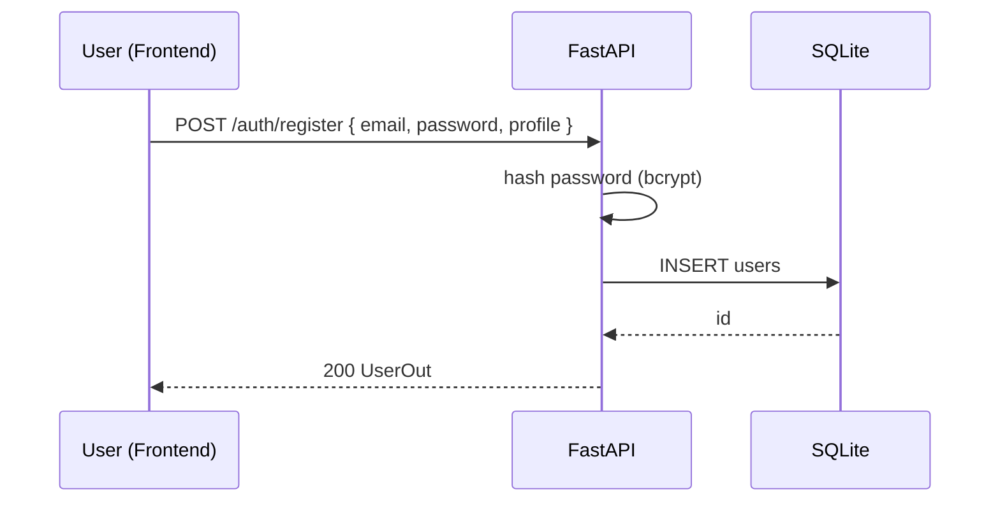
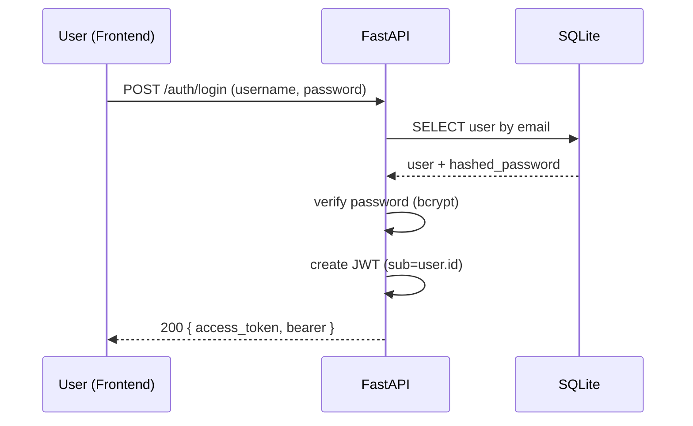
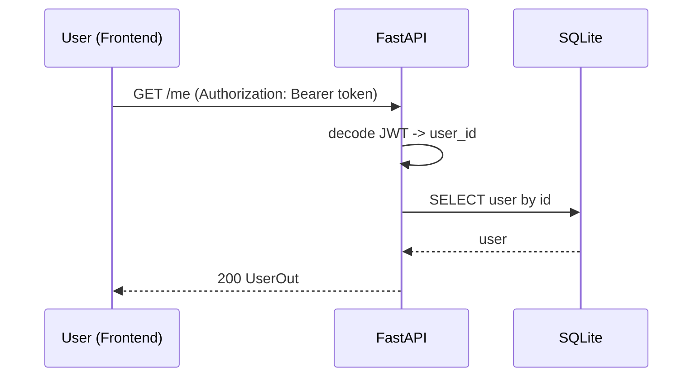
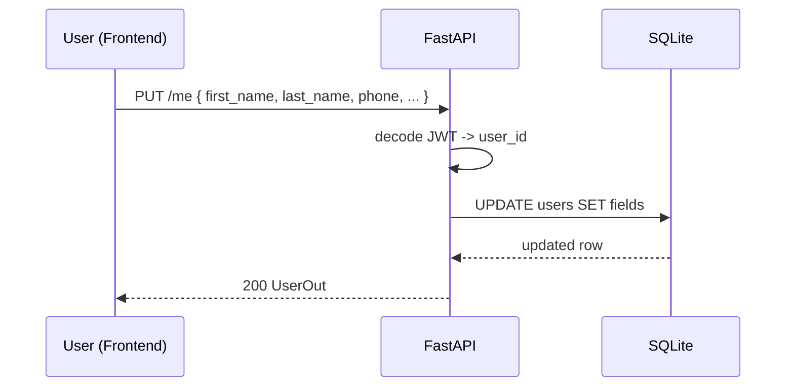

### Auth and Profile Flows (Sequence Diagrams)

#### Register

```mermaid
sequenceDiagram
    participant U as User (Frontend)
    participant A as FastAPI
    participant DB as SQLite

    U->>A: POST /auth/register { email, password, profile }
    A->>A: hash password (bcrypt)
    A->>DB: INSERT users
    DB-->>A: id
    A-->>U: 200 UserOut
```

#### Login

```mermaid
sequenceDiagram
    participant U as User (Frontend)
    participant A as FastAPI
    participant DB as SQLite

    U->>A: POST /auth/login (username, password)
    A->>DB: SELECT user by email
    DB-->>A: user + hashed_password
    A->>A: verify password (bcrypt)
    A->>A: create JWT (sub=user.id)
    A-->>U: 200 { access_token, bearer }
```

#### Get Profile

```mermaid
sequenceDiagram
    participant U as User (Frontend)
    participant A as FastAPI
    participant DB as SQLite

    U->>A: GET /me (Authorization: Bearer token)
    A->>A: decode JWT -> user_id
    A->>DB: SELECT user by id
    DB-->>A: user
    A-->>U: 200 UserOut
```

#### Update Profile

```mermaid
sequenceDiagram
    participant U as User (Frontend)
    participant A as FastAPI
    participant DB as SQLite

    U->>A: PUT /me { first_name, last_name, phone, ... }
    A->>A: decode JWT -> user_id
    A->>DB: UPDATE users SET fields
    DB-->>A: updated row
    A-->>U: 200 UserOut
```

